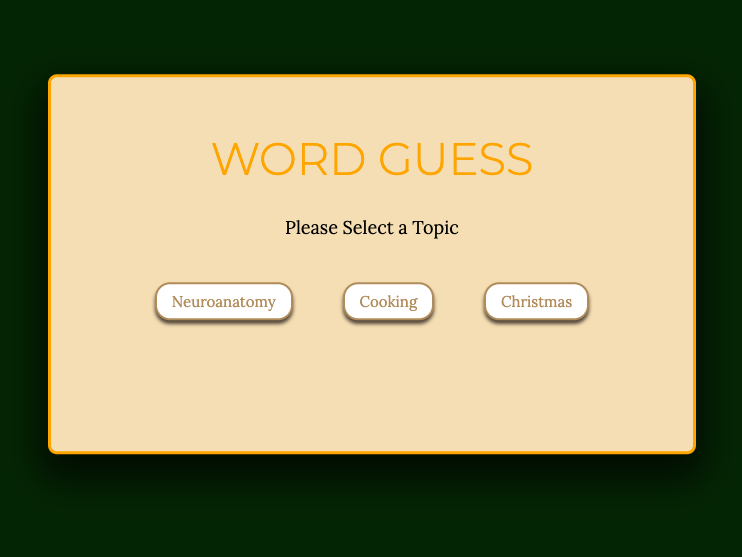
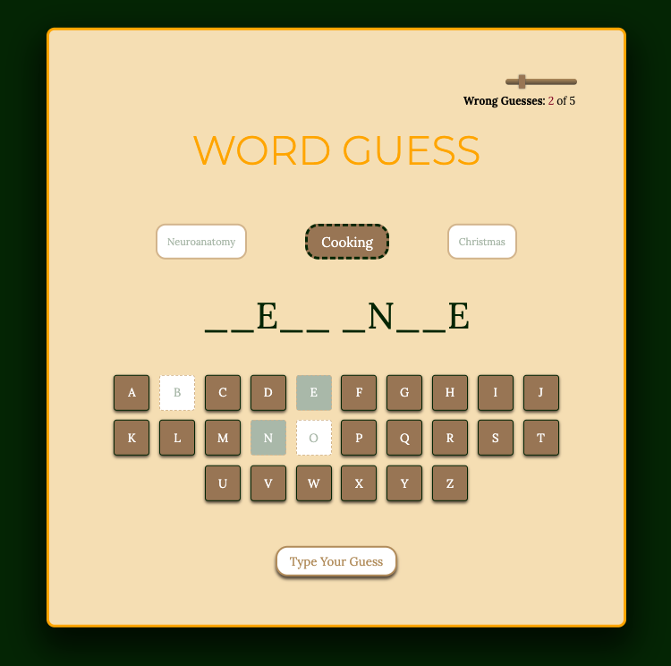
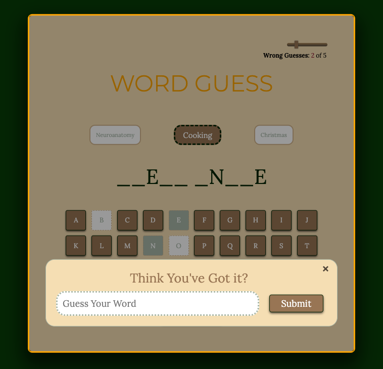
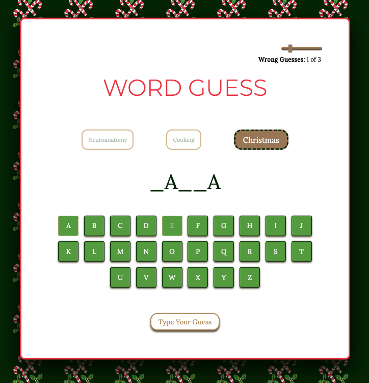

# Word Guess

## About
A less graphic take on the staple childhood game Hangman.

[Live Link](https://sharonogbonna.github.io/Project1-WordGuess/)

## Game Rules and Features
##### Rules
To begin the game, select a topic. This will generate a random word related to said topic. 

To begin guessing the word, click on a letter that you believe to be in the word. If the selected letter is in the word, it will replace the dash marking its spot in the word. If the selected letter is not in the word, it will count towards your number of wrong guesses.

You win the game when you correctly guess the word.

You lose the game when you run out of wrong guesses.  The number of wrong guesses you have is determined by the total number of letters in the randomly generated word. 
*For items with 6 letters or less, you will have 3 chances.
*For items with 7 to 15 letters, you will have 5 chances.
*For items with over 15 letters, you will have 7 chances.

##### Features
There is also a feature to type your guess. This can be useful if you think you may know the word and don't want to click each remaining letter. You can type your guess and click submit to check. If your typed guess is correct than you will win the round. If it is wrong, it will count towards your number of wrong guesses.

The slider, located in the top right corner controls volume of the background music. Slide to the left all the way to mute.

 
## Screenshots

A fun change when you select the Christmas theme.

## Motivation
I am enrolled in a software engineering bootcamp (15wks). This was our first project assignment on week 6. We were tasked with creating a game. 

## Technologies Used
This project was made using HTML/CSS/JavaScript and is deployed using GitHub Pages

## How to Access
To fork:
Select the fork button in the upper right hand corner

To clone: 
type `git clone https://github.com/Sharonogbonna/Project1-WordGuess.git` in your terminal

## Credits
As I mentioned earlier, this was my first project ever so I am super thankful for the guidance and help I received along the way. Special shout out my instructors, Kasper and Tishana, as well as my friend Jag. 

The CSS and layout of my game was heavily influenced by [The Coding Artist](https://www.youtube.com/watch?v=T6uht1A0114)
